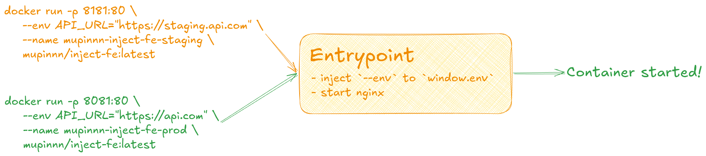
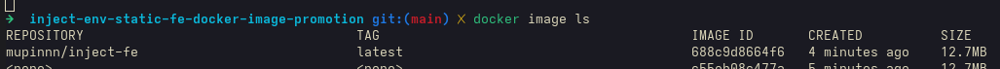
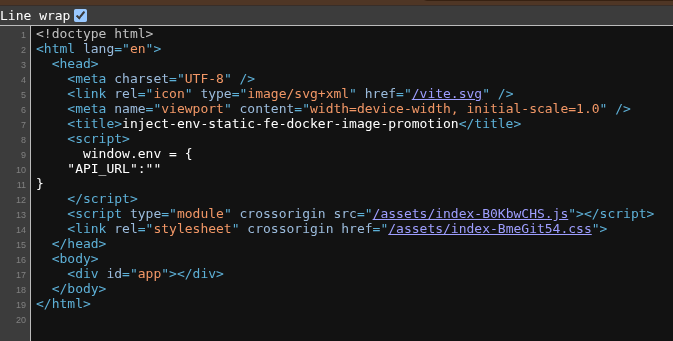
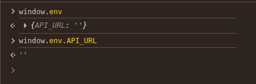
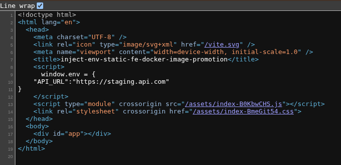
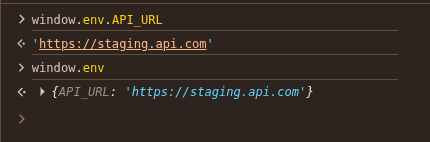
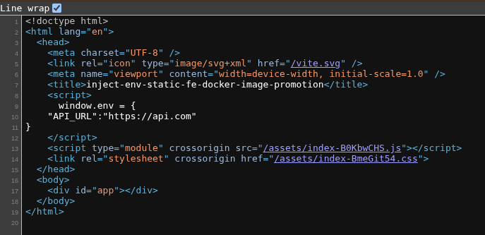
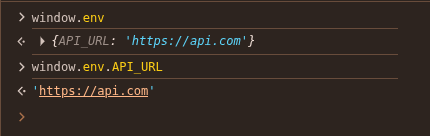

Deploying the same Docker Image from staging to production is common when using container-based deployments. Docker Image Promotion is an approach to using
Docker Image that have been built, tested, and verified for use in different environments such as staging, test, and production without needing to re-build
at each step.

Docker Image Promotion ensures consistent behavior between environments, so that the image that has been previously built and tested is the image that
is deloyed to production. Apart from that, image promotion will also cut deployment time shorter by not doing a rebuild; for example, if the build is carried out
at the deployment to staging stage, then when we want to deploy to production, we only need to "promote" the Docker Image, and not do a rebuild.

## Root of the problem

We need to know that `ARG`/`--build-arg` is only available during build time on the image and `ENV`/`--env` is available during build time and runtime on the image.
This means, if we have an environmen variables scheme as follows:
| ENV | Staging | Production |
| --------- | ----------------------- | --------------- |
| `API_URL` | https://staging.api.com | https://api.com |

So, when the image is built and in it there is a build process for our static application, generally build tools like Vite will replace the `import.meta.env.API_URL` reference
to its value directly (static replace). This will damage the process of "promoting" our image from staging to production, because production will get the wrong `API_URL`.

How about using `--env` when running the container? Please note, understanding the context of the application is very important. Because our application is a static application,
access to environment variable values with `process.env` or similar from the server is not possible; our application runs in the browser and is not pre-processed on the server (SSR).

To overcome this problem, we can use the `window` object to place the environment variable values sent via `--env` when the container is run. Of course, there is
one thing that needs to be ensured before using this method, namely making sure the value is something that is safe for the public to see, such as an API URL; **it is highly
discouraged to put any secrets into the `window` object**.

## Breaking down the solution

Because in this context our application runs in a browser environment, we can use the `window` object to hold all the values needed from `--env` when the container is run.
There are only two core steps we will do:

- Create a placeholder in the HTML file in the `<head>` section
- Create a shell script to put the values send via `--env` into the created placeholders

So, the entire deployment flow will be like the following:


We will use [this repository](https://github.com/mupinnn/inject-env-static-fe-docker-image-promotion/tree/starter) for practice, please clone and follow the steps!

### Preparing the placeholder

In the `index.html` file, we can add a placeholder in the `<head>` tag as follows:

```html
<script>
  // ENV_PLACEHOLDERS
</script>
```

### Creating shell script to replace the placeholder

This shell script is useful for replacing `ENV_PLACEHOLDERS` with a valid `window.env` values. The expectation is that the `window.env` object will
look like this:

```js
window.env = {
  API_URL: "https://staging.api.com",
};
```

We can utilize `sed` to perform text replacement on the placeholders that have been prepared. Create a file and name it `init.sh` with
value as below:

```sh
#!/bin/sh
ENV_STRING='window.env = { \
	"API_URL":"'"${API_URL}"'" \
}'

sed -i "s@// ENV_PLACEHOLDERS@${ENV_STRING}@" /usr/share/nginx/html/index.html
exec "$@"

nginx -g 'daemon off;'
```

Then, we need to copy the above `init.sh` file into our container and run it. Update the `Dockerfile` to look like this:

```Dockerfile
FROM oven/bun:1.3.3 AS base

WORKDIR /app

COPY . /app/
COPY package.json /app/package.json
COPY bun.lock /app/bun.lock
RUN bun install --frozen-lockfile

FROM base AS builder
RUN bun run build

FROM nginx:alpine-slim AS runner
COPY ./nginx /etc/nginx/conf.d
COPY ./init.sh /app/init.sh
COPY --from=builder /app/dist /usr/share/nginx/html

EXPOSE 80
CMD ["sh", "/app/init.sh"]
```

When the container is created and run, `init.sh` will be executed and will replace the placeholders with the appropriate environment variables,
then run Nginx to make our application accessible.

### Try with some test scenarios

For the first try, we will just run the container without passing any environment variables. Before that, we need to build the image with the
available `Dockerfile`. Please run the following command:

```sh
docker build -t mupinnn/inject-fe .
```

If the build process is complete, you can ensure the image is ready by running the `docker image ls` command and seeing that the image with the name
`mupinnn/inject-fe` already exists.


Then, we will create and run a container based on the image we created earlier with the command:

```sh
docker run -p 8181:80 \
mupinnn/inject-fe:latest
```

The above command will start the container and make it accessible via http://localhost:8181. You can verify that `window.env` is available
by opening the page source (<kbd>CTRL + u</kbd>) or opening the console and typing `window.env`.



Okay, so now we've successfully replaced the placeholder with the desired `window` object. Next, we need to test it with different environment variable values.

---

Next, we will run it with the `API_URL` for staging as follows:

```sh
docker run -p 8082:80 \
--env API_URL="https://staging.api.com" \
--name mupinnn-inject-fe-staging \
mupinnn/inject-fe:latest
```

Access http://localhost:8082 and double-check that the `window.env` values are present, as in the previous step. The final result should look like this:



Then, we will run the container for production from the same image with the command:

```sh
docker run -p 8083:80 \
--env API_URL="https://api.com" \
--name mupinnn-inject-fe-prd \
mupinnn/inject-fe:latest
```

Access http://localhost:8083 and double-check the `window.env` value as above. You'll notice that the `API_URL` value changes depending on what's
passed through `--env`, and we did it without a rebuild!



---

To access it at runtime, you can now use `window.env.API_URL`. If you're not using Docker at all during development, `window.env` won't be available.
You can access its value using a fallback like `import.meta.env.API_URL ?? window.env.API_URL`. For ease of use, you can create a helper function to
access environment variable.

```js
function getEnv(key) {
  const envMap = {
    API_URL: import.meta.env.API_URL,
  };

  return window?.env?.[key] || envMap[key];
}
```

If you're using TypeScript and Vite, you can improve the developer experience by making `getEnv` function more type-safe.

```ts
export function getEnv<K extends keyof ImportMetaEnv>(key: K) {
  const envMap = {
    API_URL: import.meta.env.API_URL,
  };

  return window?.env?.[key] || envMap[key];
}
```

Then, you can extend the type of the `window` object by adding the code below to the `vite-env.d.ts` file.

```ts
declare global {
  interface Window {
    env?: ImportMetaEnv;
  }
}
```

## The real workflow

The process above is a brief proof-of-concept and can be implemented in simple deployment scenarios. More complex and structured organizations typically
label and tag images at each stage. Labeling and tagging facilitate tracking and rollback if an error occurs in the application or while running the container.

Of course, labeling and tagging don't required a build process, so the process above is still relevant. Build once, multiple environments, deploy anywhere.

## Conclusion

With a simple shell script, understanding the deployment process, understanding the difference between runtime and build time, and understanding the environment
in which the application runs—you will be able to maximize all the potential and possibilites that exist to optimize from this knowledge.

Thank you!

## Reference

- https://oneuptime.com/blog/post/2026-02-08-how-to-implement-docker-image-promotion-between-registries/view
- https://stackoverflow.com/a/58327381
- https://vite.dev/guide/env-and-mode#env-variables-and-modes
