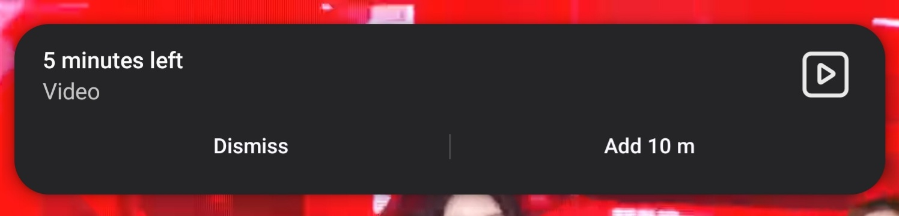
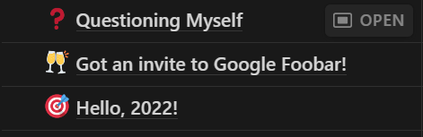
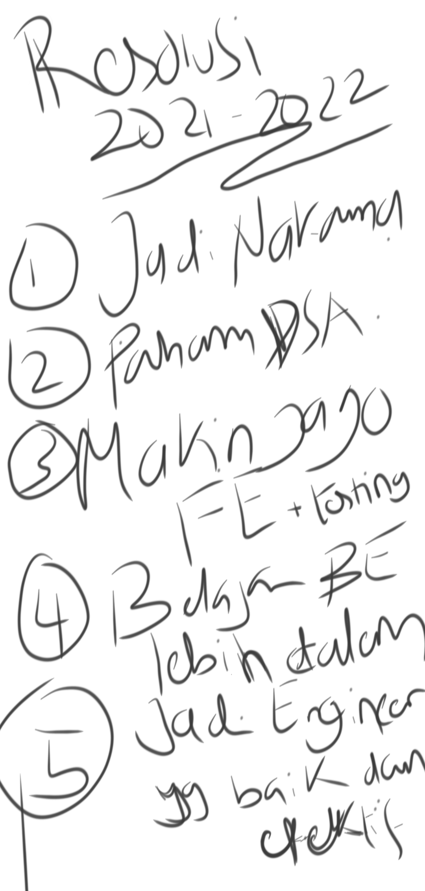
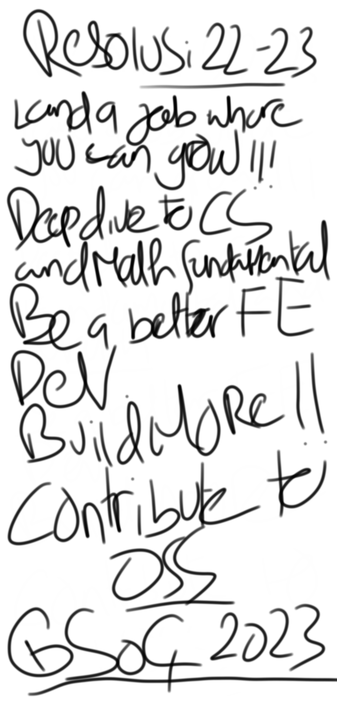

**Halo, manusia!**

Selamat datang di ruang memoar digital gue. Tempat ini gue peruntukan khusus untuk tulisan yang sifatnya pribadi
atau nonteknis; di luar keseharian gue sebagai seorang _web developer_. Ini berkaitan dengan salah satu cita-cita
gue untuk menulis tentang apa yang sudah/sedang gue pelajari dalam _web development, software engineering_ dan
sebagainya yang akan gue tempatkan khusus di [mupin.dev](http://mupin.dev/blog)!

Yap, betul sekali. Salah satu impian gue adalah bisa menulis _technical blog_ yang bertujuan untuk mengukur seberapa
mampu gue menyampaikan ulang hal yang sebelumnya telah atau sedang gue pelajari. Kenapa ini bisa jadi penting?
karena gue percaya pada prinsip:

> Jika gue tidak bisa menyampaikan sesuatu yang sudah gue pelajari dengan jelas dan mudah dimengerti, maka hal tersebut belum benar-benar meresap di kepala gue.

Serta prinsip ini yang paling gue suka:

> Otak itu seperti wadah kosong yang jika diisi air terus menerus akan meluber. Lain hal jika air tersebut dituang ke wadah-wadah lain sambil tetap mengisi wadah utama.

Pikiran ini punya kapasitas; seberapa besarnya gue ga tau—yang pasti ketika gue merasa _overhelmed_, memindahkan
isi pikiran ke tulisan (_journaling_) itu ngebantu banget buat ngurangin beban pikiran.

Memoar ini isinya ga cuma curhat-curhat aja, tapi bisa segala kejadian yang gue alami dan pengen gue tulis
tentang itu sebagai pengingat “Oh, gue pernah ngalamin ini ternyata dan reaksi gue seperti itu.”. Menyenangkan sekali!

Kenapa memilih nama “memoar” dan bukan jurnal, esai atau mungkin diari? Kata memoar ini sering gue denger pada saat
baca/nonton sesuatu yang berhubungan dengan sejarah; salah satunya pada saat gue lagi baca buku _Mohammad Hatta: Biografi Singkat 1902-1980_
yang ditulis oleh Salman Alfarizi. Salah satu bagian memoar Bung Hatta favorit gue adalah interaksi antara pilot PBY Catalina, Sjahrir, dan
Hatta itu sendiri saat proses penjemputan dari Banda Neira ke Surabaya.

Pada awalnya, gue berpikir kata “memoar” itu hanya diperuntukkan untuk pelaku sejarah—karena memang sering kali seperti itu.
Sampai akhirnya gue menemukan [“Menulis Memoar Pribadi”](https://ivanlanin.medium.com/menulis-memoar-pribadi-2fb93f247143) oleh Ivan Lanin
yang memantapkan gue untuk menggunakan kata “memoar” tersebut.

---

## Latar Belakang

Sebagai generasi Z serta mungkin _digital native_ yang cukup merasakan masifnya disrupsi internet, belakangan ini gue merasakan
kemampuan kognitif serta fokus gue agak berkurang (kasihan, mana masih muda). Salah satu penyebabnya adalah kecanduan berselancar
konten media sosial format baru: video pendek. Siapa sangka? Gue pun kaget setelah baca beberapa utas di Twitter/X tentang dampak
nyata yang dialami masyarakat akibat konten video pendek seperti di TikTok, Instagram Reels dan YouTube Shorts. Baiknya, mereka juga
membagikan bagaimana cara mereka keluar dari lingkaran setan tersebut serta cara mempertahankan kemampuan kognitifnya. Berikut adalah
beberapa utas yang bisa kalian baca dan resapi:

- https://x.com/kotakmakan/status/1749963903029895228?s=20
- https://x.com/dependentbeing/status/1747262937507786761?s=20
- https://x.com/lurino/status/1747268321849057711?s=20

Hal yang gue lakukan untuk menjaga kemampuan kognitif, fokus serta konsentrasi:

1. **Bermain rubik**

   Sebelumnya tidak pernah sekalipun gue berhubungan dengan benda ini secara serius karena terbentur pemikiran “Ah, sulit”, “Gue tidak pandai matematika, rubik butuh rumus”.
   Pemikiran tersebut perlu gue abaikan demi otak yang lebih sehat dan gue memutuskan untuk membeli rubik 3x3 dan mempelajarinya melalui [video ini](https://youtu.be/-Wxrs4MbiFc?si=4LuEjRN1QQ8vwTIO).

   Hasilnya? Ternyata tidak sesulit yang dibayangkan dan gue bisa pelajari itu dalam kurun waktu 2 jam dan untuk memperlancarnya 1 hari.

2. **Menahan diri untuk tidak menonton Instagram Reels ataupun YouTube Shorts**
3. **Membatasi waktu harian menggunakan media sosial**

   Setiap media sosial yang gue punya itu gue batasin maksimal 1 jam per harinya. Ini butuh waktu sangat lama untuk konsisten
   karena gue pun pada awalnya suka curang menambah waktu ketika ada notifikasi bahwa aplikasi yang gue gunakan waktunya
   tersisa 10 menit lagi di hari itu.

   Selain fitur ini, gue juga memanfaatkan _focus mode_ untuk menonaktifkan beberapa aplikasi yang tidak dibutuhkan ketika mode
   tertentu diaktifkan. Misal pada saat bekerja, aplikasi-aplikasi non-esensial dan media sosial akan nonaktif sampai gue menonaktifkan kembali _focus mode_ tersebut.

   

   

4. **Menulis**

   Perjalanan menulis gue dimulai dari menulis jurnal harian yang tidak begitu harian. Mungkin bisa dibilang itu adalah jurnal
   peristiwa hidup, hahahaha. Dimulai pada tahun 2021 hingga tahun ini, tercatat sudah ada 12 tulisan yang jika dilihat memang semua
   ditulis ketika ada peristiwa tertentu.

   

## Kalut

Gue selalu merasa tidak produktif ketika keseharian gue seminggu penuh hanyalah bangun pagi, kerja, pulang dan tidur.
Akhir pekan pun hanya gue habiskan buat istirahat penuh. Kadang main _game_ atau nyicil _side project_ kalo ga begitu lelah
(nyatanya tidak ada progres, lelah terus). Untungnya masih rutin badminton setiap hari minggu untuk mempertahankan kewarasan.

Perasaan itu selalu muncul karena gue merasa stagnan; ga ada peningkatan sama sekali dari kemampuan sampai kualitas hidup.
Ini cukup bikin gue takut buat menghadapi kenyataan bahwa umur gue dikit lagi 30 (sebenernya baru banget 23, tapi waktu berjalan cepat brouw)
dan gue ga bisa bersaing lagi.

Untuk tetap bisa bersaing, setiap harinya gue mikirin gimana caranya untuk memanfaatkan waktu sebaik mungkin dengan fokus yang tetap terjaga.
Kenyataannya memang cukup sulit buat _maintain_ itu konsisten dengan rutinitas sekarang; jam 7 berangkat ke kantor dan sampai di antara
jam 8.30 sampai 9.10 tergantung lalu lintas; pulang jam 6—sampai rumah jam 8.30 paling lama—lagi-lagi tergantung lalu lintas.
Melelahkan, sulit untuk fokus ketika sudah sampai rumah. Memang untuk mencapai sesuatu itu pasti ada harga yang harus dibayar—antara gue harus
bergadang atau bangun jam 3 pagi untuk belajar. Hasilnya? tidak ada. Gue terlalu lelah untuk tetap terjaga dan bangun terlalu dini.

Gue juga merasa bahwa perasaan gue itu mengarah pada _toxic productivity_. I mean, its really okay to not have a progress or just a
little progress. Progress is still a progress.

Gue harus selalu _keep in mind_ diskusi gue beberapa tahun lalu sama [Bang Iqbal](https://x.com/iqbalsyaa) ketika gue lagi demotivasi.
Gue mencatat beberapa poin penting dari obrolan tersebut di jurnal, berikut salah satu penggalannya:

> Kata dan kalimat yang tidak akan pernah gue lupa adalah **“Setiap orang punya irama dalam hidupnya masing-masing”**.
> Gapapa banget lu ngerjain sesuatu lamban. Gapapa banget ketinggalan. Gapapa banget. Gapapa. Orang yang ngerjain sesuatu cepet itu dulunya juga lamban.
> Orang yang terdepan juga dulunya tertinggal. Hidup bukan kompetisi. **It's totally fine.**

## Manifestasi

Menurut gue, manifestasi itu adalah bentuk termudah dalam menulis. Karena pada dasarnya cuma menulis apa yang kalian inginkan. Seperti harapan.

Tahun 2021 menjadi tahunnya gue kehilangan arah dalam karir karena menyadari bahwa untuk menjadi _software engineer_ yang _kaffah_ itu
panjang perjalanannya, terlebih gue datang dengan latar belakang “hanya” lulusan SMK yang mana kesalahan gue pada saat sekolah itu ga sadar
akan pentingnya pemahaman algoritma dan struktur data. Gue sering kesulitan ketika dihadapkan dengan proses bisnis atau _requirement_ aplikasi
yang kompleks karena kurangnya pemahaman gue akan hal dasar tersebut.

Setelah gue merenung dan ngobrol-ngobrol sama beberapa temen gue waktu itu (thanks _fren_, terutama ex-Garenians), hal pertama yang gue
pikirkan adalah buat target jangka panjang untuk tahun itu atau kerennya “resolusi tahun baru”. Tujuan utama gue adalah menjadi _front-end developer_
yang lebih baik lagi dan berangkat dari sana, gue _rinciin_ lagi tuh kira-kira hal apa yang gue perlukan untuk mencapai tujuan tersebut.

Kalian bisa lihat di bawah ini adalah resolusi gue periode 2021-2022 yang gue jadikan _lockscreen wallpaper_ pada saat itu agar gue selalu inget tujuan gue tiap mau buka hp.

Kalo kurang jelas tulisannya (maaf ya), berikut daftarnya:

1. Jadi Nakama

   Nakama itu sebutan untuk karyawan Tokopedia. Gue punya tujuan tersebut adalah untuk belajar lebih banyak lagi terutama dalam
   hal _maintain_ aplikasi sebesar/sekelas Tokopedia.

   Apakah tercapai? Tentu tidak. Kirim lamaran pun tidak pernah jadi, hahaha.

2. Paham DSA (algoritma dan struktur data)
3. Makin jago FE _(front-end)_ + _testing_
4. Belajar BE _(back-end)_ lebih dalam
5. Jadi _engineer_ yang baik dan efektif

Di bawah ini adalah resolusi gue untuk periode 2022-2023:

Sekali lagi, kalo kurang jelas tulisannya, berikut daftarnya:

1. Land a job where you can grow

   Realistis, gue ubah tujuan dari “Jadi Nakama” ke “Cari kerjaan dan tempat yang bisa bikin lu berkembang” dan gue sampai sekarang
   masih bekerja di tempat tersebut. I really learn a lot of stuff there.

2. Deep dive into CS _(computer science)_ and math fundamental
3. Be a better FE _(front-end)_ developer
4. Build more!

   _Build more_ ini dalam konteks _side project_ yang harus gue selesaikan sebagai media pembelajaran gue untuk menjadi _front-end developer_ yang lebih matang lagi.

5. Contribute to OSS

   Karena di tahun 2022 gue berhasil membuat kontribusi pertama gue, jadi di sini gue berniat untuk bisa berkontribusi lebih ke
   proyek-proyek _open source_ lainnya, tapi takdir berkata lain. Sulit dan tidak ada waktu. Mungkin memang belum saatnya.

6. ~~GSOC 2023~~

   Google Summer of Codes.

Apakah semua yang gue tulis itu terjadi? Tidak. Semua itu proses jangka panjang dan gue bersyukur punya tujuan tersebut biar ga kehilangan arah (lagi).

## Harapan

Gue cuma mau diri gue di masa depan itu **berterima kasih;** bukan **menyesalkan** atas apa yang gue perbuat di masa ini.
Apapun yang gue lakukan di masa ini jika tanpa pikir panjang kedepannya tentu diri gue di masa depan akan marah dan menyesal
yang mana itu juga diri gue yang merasakan. “Selagi bukan orang lain yang marah atau menyesal, tidak masalah, dong?”—memang
betul—alangkah lebih indah jika gue tinggal menikmati hasil di masa depan, bukan?

Semua akan lebih mudah jika sebelumnya sudah ada pondasi yang konkrit. Setidaknya itu yang harus gue lakukan untuk diri gue sendiri.

Bagi gue, tulisan juga dasar dari segala hal yang ingin gue tuju. Lancar bicara di depan umum yang mana perlu kemampuan
mengeluarkan isi pikiran secara cepat dan terstruktur; bisa menulis dokumentasi teknis yang bermanfaat dalam pekerjaan dan
mengajar. Hal tersebut dasarnya ada pada menulis. Menulis membantu gue untuk berfikir lebih terstruktur dan media untuk mengeluarkan
isi pikiran yang nantinya akan gue asah dengan kemampuan berbicara yang lebih baik lagi.

Jadi, teruntuk diri ini di masa depan, tetaplah atau mulai kembali hal-hal positif yang sebelumnya pernah dilakukan, seperti:

1. _Push rank_ Duolingo

   Punya cita-cita kerja _abroad_ tapi _speaking_ Inggris lu jelek gimana ceritanya? WWKWKWKWWK. Nanti gue _publish_ juga
   deh cerita gimana jeleknya artikulasi dan penyampaian gue ketika ngobrol pake bahasa Inggris. Ini bukan sombong ya,
   karena gue cukup merasa aneh ketika SD-SMK gue punya nilai bahasa Inggris yang cukup baik tapi ketika dipake buat ngobrol
   malah _ngang-ngong-ngang-ngong_. Sepertinya ini efek dari kurangnya praktek percakapan verbal di mata pelajaran tersebut.
   Lebih sering jawab soal dari bacaan, jadi bagusnya cuma di baca, tulis, dan memahami. Bukan percakapan.

2. _1 day 1 problem_ via LeetCode atau HackerRank

   Ini udah ga pernah gue lakuin lagi semenjak dapet pekerjaan. Sibuk dan belum ada waktu. Tapi, ini harus diusahakan banget
   setidaknya seminggu sekali deh kalo ga bisa 1 hari 1 soal. Latihan ini penting banget buat asah logika serta kemampuan struktur
   data dan algoritma gue. Selain itu ya bisa buat _interview_.

3. Olahraga

   Mulai _weightlifting_ dan jalan pagi lagi. Jalan pagi sebelum kerja enak banget, asli. Lebih seger dan fokus pas kerja.
   Gue memutuskan buat jalan ekstra di pagi hari untuk mencapai target baru yaitu 10.000 langkah per hari yang mana target
   sebelumnya adalah 5.000 langkah tiap hari sudah konsisten tercapai.

4. Beresin _backlog_ proyek

   Sekarang setidaknya ada 9 ide yang udah gue catet dari beberapa tahun lalu dan baru beberapa yang terealisasi.

   Mungkin ini bakal seperti _ultimatum_ buat diri gue sendiri, jadi tolong sampai akhir tahun nanti (2024) ini semua udah beres.

   Ini bisa jadi tempat gue bermain dan belajar. Jadi, tolong banget ini mah 🙏.

   .png>)

Terima kasih kepada diriku dan kalian yang sudah membaca sampai sejauh ini. Cheers!
